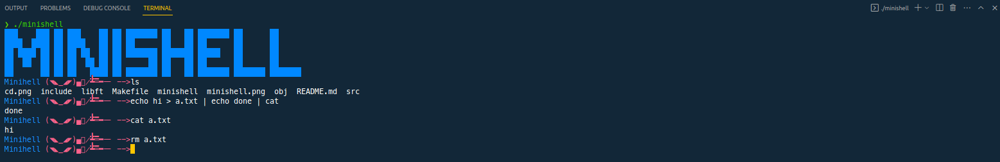
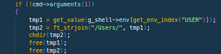

Copy code
# Ecole-42-minishell

A simple UNIX command interpreter, made as a project for Ecole 42.

## Description

This project consists of implementing a simple command interpreter, or "shell". The shell should be able to prompt the user for input, read the input, parse it, and execute the corresponding commands and/or programs.

The implemented shell must:

- Display a prompt when waiting for input from the user
- Search and launch the right executable (based on the PATH variable or by using relative or absolute path) like in bash
- It must implement the builtins:
  - `echo` with option '-n'
  - `cd` with only a relative or absolute path
  - `pwd` without any options
  - `export` without any options
  - `unset` without any options
  - `env` without any options and any arguments
  - `exit` without any options
- ; in the command should separate commands like in bash
- ' and " should work like in bash except for multiline commands
- Redirections `<`, `>` and `>>` should work like in bash except for file descriptor aggregation
- Pipes `|` should work like in bash
- Environment variables (`$` followed by characters) should work like in bash

## Getting Started

### Prerequisites

- A C compiler, such as `gcc`

### Installing

1. Clone the repo
   ```sh
   git clone https://github.com/your_username/Ecole-42-minishell.git

2. Compile the program
   ```sh
   make

## Usage
To start the shell, run the executable created during installation:

    ./minishell


### Screenshot
Here is screenshot of the Ecole-42-minishell in action:



### Important Note
I wrote the project for MAC. For cd built-in you have to change the following code line to your system's file hierarchy.



